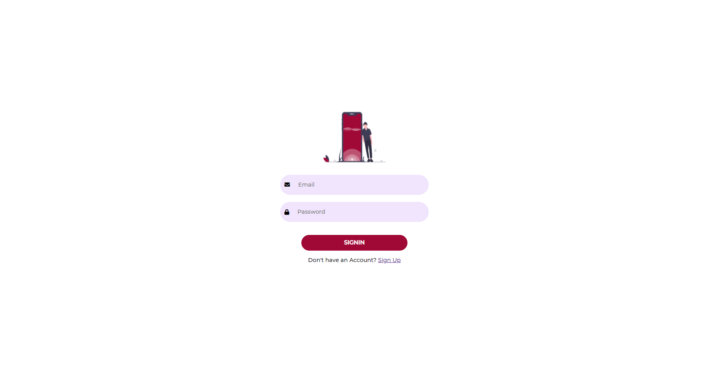

# Grootan-Challenge

## Process Explaination

* Create a Mock API using Beeceptor.com to fetch the list of users.
* Add up the Dummy Sign In and Sign Up page.
* After Sign In, redirect the page to the List of users displayed.
* In that page we can view the list of users.
* There on clicking View Details, we can view the Details about the users.
* I have made the website responsive and user-friendly.

## Languages Used

* HTML, CSS, PHP

## Website Link

* Hosted on 000Webhost.com <a href="http://www.google.com">Website Link</a>

## Implementation Screenshots

